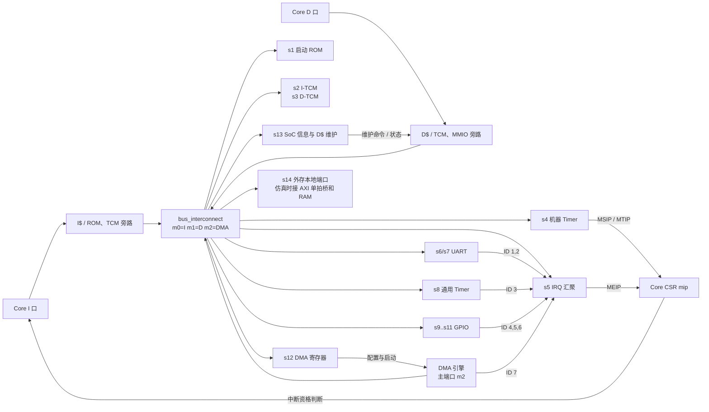

# SoC 与外设接口

以下连线和寄存器描述对应 s5/cache-up 的 soc_top；旧分支实际连接范围见 [分支文档说明](README.md)。

## 实现范围与层次

`soc_top` 组合 Core、复位 ROM、两个 64 KiB TCM bank、互连和
`soc_peripherals`。Core 保持六级，不包含 BRAM 或 MMIO 设备。
外设采用可移植 RTL，尚未完成厂商综合、资源/时序检查和板级连接。
DMA 已实现；外存仅有可配置的本地端口和仿真 AXI RAM，尚无板级 DDR 控制器。
DDR 两路 I$/D$ 已接入，MMIO/TCM 保持旁路。
MMU、S/U 模式、WFI 不在本版范围；Cache 契约见 [访存接口](SOC_BUS_CONTRACT.md)。

地址、权限和错误契约见 [SoC 访存契约](SOC_BUS_CONTRACT.md)。
普通 MMIO 仅接受对齐 32 位访问，包括 RV64；不自动拆分有副作用的 LD/SD。
寄存器偏移未实现、只读寄存器写入或格式错误返回 SLVERR。
写掩码按字节生效，读写副作用仅发生在请求接受沿，响应反压不重复执行。

## 连接图：请求、响应和中断

图中的实线是请求/响应路径；标有 MSIP、MTIP、MEIP 的线是中断电平。DMA 寄存器作为从端接受 CPU 配置，DMA 引擎作为主端主动发起拷贝，两种角色同时存在。

最后一条 CSR → Core D 的箭头只表示控制信息返回 Core，不是一次访存。UART/GPIO 的引脚直接连 soc_top 的外部端口；具体 FPGA IOBUF、时钟约束及 DDR PHY 不在此模块内。commit 与 dmem_store_fire 是被动观察输出，供仿真读结果或调试，硬件不会识别 tohost。

## 从端编号与源码定位

编号是 bus_types_pkg 的 TARGET 枚举索引，也是 soc_top 的 s_req/rsp 数组下标。越界或权限错误会先改道 s0，不会进入原目标设备。

| 下标 | 地址/设备 | 在 soc_top 或 soc_peripherals 中的实例 | 发出的主要信号 |
|---:|---|---|---|
| 0 | 错误返回 | u_error | DECERR 或 SLVERR 响应 |
| 1 | 0x0000_0000 ROM，16 KiB | u_rom | 复位跳转指令 |
| 2 | 0x0100_0000 I-TCM，64 KiB | u_itcm | 可执行 RAM |
| 3 | 0x0110_0000 D-TCM，64 KiB | u_dtcm | 数据与栈 RAM |
| 4 | 0x0200_0000 机器 Timer，64 KiB 窗口 | u_mtime | MSIP、MTIP |
| 5 | 0x0c00_0000 IRQ 汇聚，4 MiB 窗口 | u_irq | MEIP |
| 6、7 | 0x1000_0000、0x1000_1000 UART | g_uart[0/1] | TX/RX、ID 1/2 |
| 8 | 0x1001_0000 通用 Timer | u_timer | ID 3 |
| 9..11 | 0x1002_0000 起每 0x1000 一个 GPIO | g_gpio[0..2] | ID 4/5/6 |
| 12 | 0x1003_0000 DMA 寄存器 | u_dma.u_regs | ID 7、DMA 配置 |
| 13 | 0x1004_0000 SoC 信息 | u_info | D$ 维护命令、状态 |
| 14 | 0x8000_0000 起的 DDR | soc_top 的 ddr_req/rsp 端口 | 外部存储器 |

下标 4..13 在 soc_peripherals 里连到各模块；s14 直接由 soc_top 暴露。PRESENT 位图决定从端是否安装，DDR_BYTES=0 时 s14 不存在。soc_addr_pkg 给出起始地址，soc_config_pkg 给出 TCM 容量与 DDR 窗口；地址译码检查实际容量。地址表占有更大的区域不表示整个区域都存在 RAM。RV32/RV64 共用同一份物理表，RV64 地址高位非零要报 DECERR。

## 设备访问怎样发生

一般设备经 mmio_endpoint 接入。CPU D 请求先通过完整地址、对齐与读写权限检查；MMIO 只接受对齐 32 位访问。端点在 req_valid 与 req_ready 同时为 1 的上升沿产生 access_fire，设备在这个沿写寄存器、领取中断或弹出 RX 字节；端点同时记录一份响应。如果 WB 尚未给 rsp_ready，响应保持，读清除和写入都不会再次执行。旧响应被消费的同一个上升沿可以接受下一笔请求。

RV64 对 0x...004 的 32 位寄存器访问处于 XLEN 总线字的高半部分。端点用地址低位将 wdata 和字节掩码还原成寄存器的低 32 位，并把读值放回正确总线 lane；不允许用无掩码赋值覆盖相邻寄存器。机器 Timer 没有使用普通 32 位端点：MTIME/MTIMECMP 需要 RV64 对齐 64 位原子访问，并保留 RV32 的高低半字访问。

例如向 UART0 TXDATA 写一个字节：Core MEM 生成 32 位设备访问，D$ 判定 MMIO 旁路，互连将它路由到 s6；uart 的请求沿锁存字节，随后返回写响应；WB 收到响应才允许这条 Store 退休。TX 忙时写入返回 SLVERR，WB 对当前 Store 形成 access fault。串口引脚发送需要多个系统时钟，写响应不表示整帧已经发完。

## 三条中断线如何形成

机器 Timer 的 MSIP 位直接形成 irq_software；MTIME >= MTIMECMP 直接形成 irq_timer。UART0/1、通用 Timer、GPIO0/1/2、DMA 依次成为 IRQ 控制器的 ID 1..7。七路都是电平源；优先级、enable[7:1] 和 threshold 共同选出当前可领取的最高优先级 ID，控制器的 irq 输出接 Core 的 irq_external。

Core 的 csr_file 把这三条线映射到 mip.MSIP/MTIP/MEIP，再用 mie 对应位与 mstatus.MIE 判断中断资格。中断已 pending 时只停新取指，已接受的取指和较老指令继续排空；真正进入 trap 才执行重定向。CPU 读 CLAIM 在请求接受沿领取一个 ID；处理程序先清 UART/Timer/GPIO/DMA 的设备原因，再向 COMPLETE 写同一 ID。设备仍保持高电平时会重新挂起。该控制器只有一个 hart、一个上下文和七个源，不能据此声称完整 PLIC 兼容。

一条具体路径：通用 Timer 到达 LIMIT，STATUS.pending 置 1；若 CONTROL.IRQ_EN 有效，则源 ID 3 进入汇聚；配置了 PRIORITY[3]、ENABLE[3] 和合适 THRESHOLD 后，MEIP 置 1；Core 同时检查 mie.MEIE 与 mstatus.MIE，排空后进入 mtvec；软件清 Timer STATUS，再 complete ID 3，最后 MRET 返回被中断的下一条指令。

## 读源码时按连接顺序检查

先看 [soc_top](../vsrc/soc/soc_top.sv) 的三个 m 端和十五个 s 端，再看 [soc_peripherals](../vsrc/soc/peripheral/soc_peripherals.sv) 如何接 s4..s13。读单个设备先读它的寄存器地址表，再跟踪 access_fire 和 irq 生成；普通设备还应检查 [mmio_endpoint](../vsrc/soc/common/mmio_endpoint.sv) 的 lane 和响应保持。最后沿 [irq_controller](../vsrc/soc/interrupt/irq_controller.sv) → [csr_file](../vsrc/core/csr/csr_file.sv) → [interrupt_entry](../vsrc/core/control/interrupt_entry.sv) 跟踪中断。

若要增加一个新 MMIO 设备，应同时分配不重叠的物理窗口、目标枚举及 s 下标，在 address_decode 和 soc_top/soc_peripherals 连线、实现有效访问的错误响应，并为读清除或 W1C 写定向测试。新增中断源还需评估七路控制器的位宽与 ID 布局。单改一个地址常量不会自动让设备可访问。

## 存储器与互连

ROM 从地址 0 跳转到 I-TCM `0x01000000`，不包含镜像下载器。
benchmark 的代码放 I-TCM，数据、栈和 tohost 放 D-TCM `0x01100000`。
I/D 访问同一个物理 bank，D-TCM 不可执行；专用 ISA 链接脚本将自修改代码的
`.data` 也放进可执行 I-TCM，因此 SoC runner 可运行上游 `fence_i`。

互连在 SoC 中支持 CPU I、CPU D 与 DMA 三主端口。CPU 顶层使用 `DATA_PRIORITY=1`：
同 bank 优先数据请求，跨 owner 交接隔一拍；不同 bank 并行，同 owner 可每拍传输。
这是为了让 D-ready 不依赖可撤回的 I-valid；CPU D 与 DMA 对同一 bank 轮流获得机会，
避免持续数据访问让 DMA 饥饿。
SoC 另有一项 I 响应缓冲：正常响应直接旁路，IF 反压时保存，互连 I-rsp-ready 恒为 1。
Core 每端口一笔在途保证该缓冲不会被覆盖；它切断共享 bank 的组合反压环，不增加正常取指延迟。
全系统复位统一清除在途状态，RAM 不清零。

## Timer0：机器时间与软件中断

基址 `0x02000000`。MTIME 每个系统时钟增加 1；不是独立的实时时钟域。
MTIME/MTIMECMP 支持 RV64 对齐 64 位访问，也支持 RV32/RV64 的两个 32 位半字。

| 偏移 | 寄存器 | 行为 |
|---|---|---|
| `0x0000` | MSIP | 32 位，bit 0 置位/清除软件中断 |
| `0x4000/0x4004` | MTIMECMP | 64 位比较值，复位全 1 |
| `0xbff8/0xbffc` | MTIME | 64 位时间，复位 0，可写 |

`MTIME >= MTIMECMP` 产生 MTIP。写 MTIME 的当拍不自增。
RV32 安全写比较值：先写高半字全 1，再写低半字，最后写真实高半字；
读取时间使用 high-low-high 重读。CSR `time/timeh` 别名尚未实现。

## Timer1：通用计数器

基址 `0x10010000`，所有寄存器 32 位。

| 偏移 | 寄存器 | 行为 |
|---|---|---|
| `0x00` | COUNT | 可读写当前计数 |
| `0x04` | LIMIT | 终点，复位全 1 |
| `0x08` | CONTROL | bit 0 enable、1 periodic、2 IRQ enable |
| `0x0c` | STATUS | bit 0 sticky pending，写 1 清除 |

enable 时每拍计数，当前 COUNT 达到 LIMIT 的沿触发事件并归零。
从 0 起算周期为 LIMIT+1 拍；one-shot 同时清 enable。
新事件与软件清除同拍时，事件优先，不丢中断。

## UART0/1

基址分别为 `0x10000000`、`0x10001000`。
8N1、无流控/奇偶校验/FIFO，各自仅一字节接收缓冲。
RX 使用两级同步并在位中点采样；TX/RX 均用系统时钟计数使能，不产生派生时钟。
DIV 最小 4，TX/RX 启动一帧时分别锁存分频值；波特率约为 CLOCK_HZ / DIV。

| 偏移 | 寄存器 | 行为 |
|---|---|---|
| `0x00` | TXDATA | 写低 8 位发送；忙时写返回 SLVERR |
| `0x04` | RXDATA | 读出并消费一个字节；空读为 0；不可写 |
| `0x08` | STATUS | bit 0 TX-ready、1 RX-valid、2 overrun、3 frame-error；2/3 写 1 清除 |
| `0x0c` | DIV | 可写分频，复位由 UART_DIVISOR 参数决定 |
| `0x10` | IRQ_ENABLE | bit 0 RX-valid、1 TX-ready、2 error 的电平中断使能 |

接收溢出保留尚未读取的旧字符并置 overrun。
RX 读接受与新字符到达同拍时，可同时返回旧字符并保存新字符。
仅凭数字环回测试不能证明板级波特率容差、CDC 约束或电气连接合格。

## GPIO0/1/2

基址 `0x10020000/0x10021000/0x10022000`，每组 32 位独立 IO。
顶层暴露 input/output/output-enable，具体 IOBUF 留在板级 wrapper。

| 偏移 | 寄存器 | 行为 |
|---|---|---|
| `0x00` | INPUT | 两级同步输入，只读 |
| `0x04` | OUTPUT | 输出值 |
| `0x08` | OUTPUT_ENABLE | 各位输出使能 |
| `0x0c` | IRQ_ENABLE | 各位中断使能 |
| `0x10/0x14` | RISE/FALL_ENABLE | 上升/下降沿检测使能 |
| `0x18` | PENDING | 边沿锁存，写 1 清除，新边沿优先 |

同步器适用于独立电平或慢速 GPIO，不提供多位总线一致性或窄脉冲捕获保证。

## 外部中断汇聚

基址 `0x0c000000`，七个电平源：ID 1/2 为 UART0/1，3 为 Timer1，4/5/6 为 GPIO0/1/2，7 为 DMA。
使用常见单上下文 claim/complete 布局，但这是精简控制器，不宣称完整 PLIC 兼容。
它没有多 hart、多上下文或可配置触发模式；本实现 claim 与 IRQ 共用阈值筛选。

| 偏移 | 寄存器 | 行为 |
|---|---|---|
| `4 × ID` | PRIORITY[1..7] | 3 位优先级，0 禁用，复位 0 |
| `0x1000` | PENDING | bit 1..7，只读 |
| `0x2000` | ENABLE | bit 1..7 |
| `0x200000` | THRESHOLD | 3 位，选取 priority > threshold 的源 |
| `0x200004` | CLAIM/COMPLETE | 读领取 ID，写完成 ID；0 表示没有可领取源 |

较大优先级先服务，同级先较小 ID。每源最多一个 pending/in-service。
claim 只在读请求接受时消费；响应被阻塞不再次领取。
处理程序须先清设备中断原因，再 complete；仍为高电平的源会重新挂起。

## DMA 控制器

基址 `0x10030000`，寄存器均为对齐 32 位访问。DMA 同时作为互连的第三主端口；
寄存器是 CPU 配置用的从端，搬运不经 CPU 软件逐字读写。

| 偏移 | 寄存器 | 行为 |
|---|---|---|
| `0x00/0x04/0x08` | SRC/DST/LENGTH | 32 位物理源地址、目的地址和字节长度；busy 时不可写 |
| `0x0c` | CTRL | 写 bit 0 启动；bit 1 保持为 IRQ_EN；busy 时不可写 |
| `0x10` | STATUS | bit 0 busy、1 done、2 error；done/error 写 1 清除 |
| `0x14/0x18/0x1c` | BYTES/FAULT/CODE | 已成功写入的字节、故障地址、结果码，只读 |

结果码 0 成功；1 配置无效；2/3 读 DECERR/SLVERR；4/5 写 DECERR/SLVERR。
DMA 只允许 I-TCM、D-TCM 与启用容量内的 DDR，拒绝 MMIO、零长度、范围重叠和越界。
对齐的整字按 XLEN 宽传输，其余字节逐个搬运；失败不回滚已完成写入。
IRQ_EN 且 done/error 置位时持续请求 ID 7；软件先读结果并清状态，再写 IRQ complete。

## Core 中断入口

`mie` 仅实现 MSIE/MTIE/MEIE；`mip` 相应三位由设备电平驱动，CSR 写忽略，
CSR 旁路也不能用在途的零写入覆盖硬件 pending。
机器中断按 MEI > MSI > MTI 优先；须同时满足全局 MIE、对应 mie 和 mip。
基础语义参照 [RISC-V Machine-Level ISA](https://docs.riscv.org/reference/isa/v20260120/priv/machine.html)。

检测到可服务中断后只停止新取指，保留已接受的 IF 请求/缓冲并允许它们继续推进。
只有真正进入 Trap 的重定向才丢弃尚未入流水的旧响应；若中断提前撤销或被 CSR 屏蔽，
继续原指令流，不能因提前清 IF 而跳过指令。已进入流水的指令继续排空。
已接受的 Load/Store、MDU 必须完成；同步异常先提交。
`interrupt_entry` 记录实际退休后继 PC，包括已跳转的分支/JAL/JALR；
排空后将其写入 mepc，mcause[XLEN-1] 置 1，mtval 为 0，进入 mtvec。
MRET 恢复 MIE/MPIE 并从 mepc 继续。mtvec 仍仅支持 Direct 模式。
中断不是退休指令，不增加 MINSTRET；中断延迟受未完成访存/运算影响。

## SoC 信息与验证入口

系统寄存器基址 `0x10040000`，仅接受对齐 32 位访问：

| 偏移 | 寄存器 | 语义 |
|---|---|---|
| `0x00/04/08/0c` | XLEN/CLOCK_HZ/ITCM_BYTES/DTCM_BYTES | 原有只读信息 |
| `0x20` | DCACHE_COMMAND | 写 1=invalidate、2=clean、3=flush；读 0，写 0/零掩码无副作用 |
| `0x24` | DCACHE_CAPS | bit 0=启用，bit 1=写回；当前有效配置返回 3，否则 0 |
| `0x28/2c` | DCACHE_BYTES/LINE_BYTES | 只读配置容量，默认 4096/32 |
| `0x30` | DCACHE_STATUS | bit 0=busy，1=error，2=fatal；[4:3] 错误码：0=无，1=写回错误，2=拒绝脏行失效 |
| `0x34` | DCACHE_FAULT_ADDR | 只读，实际故障写回 beat/脏行的 32 位物理地址 |

维护寄存器有效写掩码中的保留位非零返回 SLVERR，不触发维护；写只读寄存器报错。
控制器在请求接受沿入队，响应反压不重复执行；忙/致命错误时拒绝非零新命令。
命令响应只表示入队，不是维护完成；软件轮询 STATUS，确认 busy=0 且 error=0。
维护借用同一 D 主端口时，状态读也可能反压。无从端响应超时机制。
新软件命令清除先前错误；自动 FENCE.I clean 不清历史错误记录。fatal 只能复位解除。
这是项目 MMIO 协议，不是 Zicbom。旧版只写 1 不检查状态的维护代码需要升级。

clean 发布脏行并保留 valid；flush 发布后失效；invalidate 拒绝丢弃脏数据。
写回失败保留原脏行，已完成的 beat 不回滚。DMA 交出目的区前先 flush，
DONE/ERROR 后 invalidate 并确认成功；CPU→DMA 先 clean/flush。
DMA 期间不能修改交接行；全局维护期间避免其他 DDR 写入，使用 TCM 栈。
FENCE.I 自动 clean D$ 并失效 I$；失败停取指，CPU 不能继续跑软件错误处理程序。
CLOCK_HZ 是平台参数，不是测出的 FPGA Fmax。

`make soc-lint`、`soc-test`、`soc-software`、`soc-smoke`、
`soc-riscv-tests`、`soc-coremark`、`soc-dma-software` 均支持 `XLEN=32/64`。
原 Core-only 命令和镜像保留，SoC 镜像/日志使用独立 `-soc` 路径。
见 [仿真与 FPGA 工作流](SIMULATION_AND_FPGA.md)。
